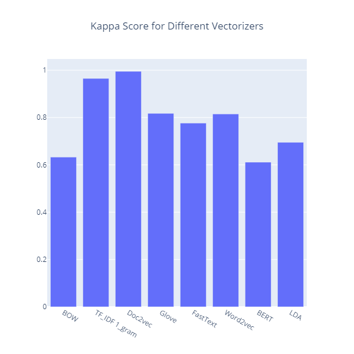
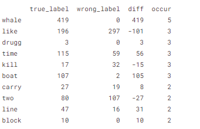

# Book-Clustering-Clustering-Is-All-You-Need


# Gutenberg
**Project Gutenberg is a library of over 60,000 free eBooks**


**Recommended to use GPU to run much faster.
But it works well with the CPU also.**
- GPU takes around 40 min, while CPU may take hours.


# Project Methodology


# Project Main Steps

- [Data Exploration](#1)
- [Data Preprocessing](#2)
- [Word Embedding](#3)
  - [BOW](#4)
  - [TF-IDF](#5)
  - [Doc2Vec](#6)
  - [Bert Embedding](#7)
  - [Glove](#8)
  - [Fast text](#9)
  - [Word2Vec](#10)
  - [LDA (Latent Dirichlet Allocation)](#11)
- [Word embedding dictionary](#12)
- [Clustering](#13)
  - [K-Means](#14)
  - [Expectation Maximization (EM)](#15)
  - [Hierarchical](#16)
- [Choosing Champion Model](#17)
- [Error Analysis](#18)
  - [Cosine Similarity](#19)
  - [Word Count](#20)
- [Conclusion](#21)


# <a name="1">Data Exploration</a>
**By discovering the books’ content as shown below:**

> Sense and Sensibility by Jane Austen 1811]\n\nCHAPTER 1\n\n\nThe family of Dashwood had long been settled in Sussex.\nTheir estate was large, and their residence was at Norland Park,\nin the centre of their property, where, for many generations,\nthey had lived in so respectable a manner as to engage\nthe general good opinion of their surrounding acquaintance.\nThe late owner of this estate was a single man, who lived\nto a very advanced age, and who for many years of his life,\nhad a constant companion.

- Many problems have been found in books' content, so we should deal with them.


# <a name="2">Data Preprocessing</a>

**Clean the content of the books by:**
- Removing the word capitalization, unwanted characters, white spaces, and stop words.
- Replacing some patterns.
- Applying lemmatization and tokenization.

**The data after cleaning process**
> delight steelkilt strain oar stiff pull harpooneer get fast spear hand radney sprang bow always furious man seem boat bandage cry beach whale topmost back nothing loath bowsman haul blinding foam blent two whiteness together till sudden boat struck sunken ledge keel spill stand mate instant fell whale slippery back boat right dash aside swell radney toss sea flank whale struck spray instant dimly see veil wildly seek remove eye moby dick whale rush round sudden maelstrom seize swimmer jaw rear high plunge headlong go meantime first tap boat bottom lakeman slacken line drop astern whirlpool calmly look thought thought

**Dataset Building**


- Create a data frame containing 2 columns and 1000 rows representing the books' samples (Sample) and the book name (Label)

**Note:** Before starting to transform words. We split the data into training and testing, to prevent data leakage.


# <a name="3">Word Embedding</a>
It is one of the trivial steps to be followed for a better understanding of the context of what we are dealing with. After the initial text is cleaned and normalized, we need to transform it into its features to be used for modeling.

We used some methods to assign weights to particular words, sentences, or documents within our data before modeling them. We go for numerical representation for individual words as it’s easy for the computer to process numbers.

  ## <a name="4">BOW</a>
A bag of words is a representation of text that describes the occurrence of words within a document, that just keeps track of word counts and disregards the grammatical details and the word order. As we said that we split the data. So, we applied BOW to training and testing data. So, it transforms each sentence into an array of occurrences in this sentence.
```Python
from sklearn.feature_extraction.text import CountVectorizer

BOW = CountVectorizer()
BOW_transformation = BOW.fit_transform(data_frame['Sample of the book'])
```


## <a name="5">TF-IDF</a>

  TF-IDF (term frequency-inverse document frequency) is a statistical measure that evaluates how relevant a word is to a document in a collection of documents. This is done by multiplying two metrics: how many times a word appears in a document, and the inverse document frequency of the word across a set of documents.
  <br><br>In addition, to understand the relation between each consecutive pair of words, tfidf with bigram has applied. Furthermore, we applied tfidf with trigram to find out wether there is a relation between each consecutive three words.
- In the project, used Uni-gram and Bi-gram

```Python
from sklearn.feature_extraction.text import TfidfVectorizer

from sklearn.feature_extraction.text import TfidfVectorizer
def tfidf_ngram(n_gram,X_train=data_frame['Sample of the book']):
    vectorizer = TfidfVectorizer(ngram_range=(n_gram,n_gram))
    x_train_vec = vectorizer.fit_transform(X_train)
    return x_train_vec

# Uni-Gram
tfidf_1g_transformation= tfidf_ngram(1,X_train=data_frame['Sample of the book'])

# Bi-Gram
tfidf_2g_transformation= tfidf_ngram(2,X_train=data_frame['Sample of the book'])
```


## <a name="6">Doc2Vec</a>
- Doc2Vec is a method for representing a document as a vector and is built on the word2vec approach.
- I have trained a model from scratch to embed each sentence or paragraph of the data frame as a vector of 50 elements.

```Python
#Import packages
from gensim.models.doc2vec import Doc2Vec, TaggedDocument
from nltk.tokenize import word_tokenize

def get_doc2vec_vector(df):
    # Tokenization of each document
    tokenized_doc = []
    for d in df['Sample of the book']:
        tokenized_doc.append(word_tokenize(d.lower()))
    
    # Convert tokenized document into gensim formated tagged data
    tagged_data = [TaggedDocument(d, [i]) for i, d in enumerate(tokenized_doc)]
    model = Doc2Vec(tagged_data, vector_size=50, window=2, min_count=1, workers=4, epochs = 100)

    doc2vec_vectors=[]
    for sentence in df['Sample of the book']:
        doc2vec_vectors.append(model.infer_vector(word_tokenize(sentence.lower())))
    return doc2vec_vectors

doc2vec_vectors=get_doc2vec_vector(data_frame)
```


  ## <a name="7">Bert Embedding</a>
Bert can be used as a word embedding pretrained model and then use these embedded vectors to train another model like SVM or Naive bayes and DL models like RNN or LSTM 

- BERT (Bidirectional Encoder Representations from Transformers) is a highly complex and advanced language model that helps people automate language understanding.
- BERT is the encoder of transformers, and it consists of 12 layers in the base model, and 24 layers for the large model. So, we can take the output of these layers as an embedding vector from the pre-trained model.
- There are three approaches to the embedding vectors: concatenate the last four layers, the sum of the last four layers, or embed the full sentence by taking the mean of the embedding vectors of the tokenized words
- As the first two methods require computational power, we used the third one which takes the mean of columns of each word and each word is represented as a 768x1 vector. so, the whole sentence at the end is represented as a 768x1 vector


## Helper Function
  This help function build to pass the data through the models Glove, Fast-text, and Word2vec model and return the embedding vectors.
```Python
def get_vectors_pretrained(df, model):
    embedding_vectors = []
    for partition in df['Sample of the book']:
        sentence = []
        for word in partition.split(' '):
            try:
                sentence.append(model[word])
            except:
                pass
        sentence = np.array(sentence)
        sentence = sentence.mean(axis=0)
        embedding_vectors.append(sentence)
    embedding_vectors = np.array(embedding_vectors)
    return embedding_vectors
```


  ## <a name="8">Glove</a>
- Global vector for word representation is an unsupervised learning algorithm for word embedding.
- We trained a GloVe model on books’ data, that represents each word in a 300x1 Vector. We took the data frame after cleaning and get each paragraph and passed it to the corpus. After that,t we trained the model on each word.
- We used also a pre-trained model “glove-wiki-gigaword-300”. Each word is represented by a 300x1 vector. Then, on each word of a sentence in the data frame, we replaced it with its vector representation.
```Python
import gensim.downloader as api
glove_model = api.load("glove-wiki-gigaword-300")  # load glove vectors
glove_vectors=get_vectors_pretrained(data_frame,glove_model)
glove_vectors
```


  ## <a name="9">Fast text</a>
- FastText is a library for learning word embeddings and text classification. The model allows one to create unsupervised learning or supervised learning algorithms for obtaining vector representations for words.
- We loaded a pre-trained model from genism API ‘fasttext-wiki-news-subwords-300’.
```Python
import gensim.downloader as api
fast_text_model = api.load("fasttext-wiki-news-subwords-300")  # load glove vectors
fast_text_vectors=get_vectors_pretrained(data_frame,fast_text_model)
fast_text_vectors
```


  ## <a name="10">Word2Vec</a>
- Word2vec is a method to represent each word as a vector.
- We used a pre-trained model “word2vec-google-news-300”.
```Python
import gensim.downloader as api
word2vec_model = api.load("word2vec-google-news-300")
word2vec_vectors = get_vectors_pretrained(data_frame,word2vec_model)
word2vec_vectors
```


  ## <a name="11">LDA (Latent Dirichlet Allocation)</a>
- It is a generative statistical model that explains a set of observations through unobserved groups, and each group explains why some parts of the data are similar. LDA is an example of a topic model.
- We used LDA as a transformer after vectorization used in BOW because LDA can’t vectorize words. So, we needed to use it after BOW.
```Python
from gensim.corpora import Dictionary
from gensim.models import LdaModel
import matplotlib.pyplot as plt
import gensim

paragraphs = data_frame["Sample of the book"].to_list()
docs = []

for sen in paragraphs:
    docs.append(list(sen.split()))
print(len(docs))

# Create a dictionary representation of the documents.
dictionary = Dictionary(docs)

# Filter out words that occur less than 20 documents, or more than 50% of the documents.
dictionary.filter_extremes(no_below=20, no_above=0.8)

# Bag-of-words representation of the documents.
corpus = [dictionary.doc2bow(doc) for doc in docs]
print(len(corpus[2]))
print('Number of unique tokens: %d' % len(dictionary))
print('Number of documents: %d' % len(corpus))

# Set training parameters.
num_topics = 5
chunksize = 2000
passes = 20
iterations = 400
eval_every = None  # Don't evaluate model perplexity, takes too much time.

# Make a index to word dictionary.
temp = dictionary[0]  # This is only to "load" the dictionary.
id2word = dictionary.id2token
#print(len(dictionary))
model = LdaModel(
    corpus=corpus,
    id2word=id2word,
    chunksize=chunksize,
    alpha='auto',
    eta='auto',
    iterations=iterations,
    num_topics=num_topics,
    passes=passes,
    eval_every=eval_every
)

top_topics = model.top_topics(corpus) #, num_words=20)

# Average topic coherence is the sum of topic coherences of all topics, divided by the number of topics.
avg_topic_coherence = sum([t[1] for t in top_topics]) / num_topics
print('Average topic coherence: %.4f.' % avg_topic_coherence)

all_topics = model.get_document_topics(corpus)
num_docs = len(all_topics)

all_topics_csr = gensim.matutils.corpus2csc(all_topics)
lda_to_cluster = all_topics_csr.T.toarray()
lda_to_cluster.shape
```
**Measure the coherence per topic of the LDA model**
```Python
from gensim.models.coherencemodel import CoherenceModel
## Evaluating coherence of gensim LDA model
cm = CoherenceModel(model=model, corpus=corpus, coherence='u_mass')
coherence_score = cm.get_coherence()
print(f"The coherence score = {coherence_score}")
```
> The output: "  The coherence score = -1.1595543844375444  "


# <a name="12">Word embedding dictionary</a>
> Saved the word Embedding as a pickle file 
for future use, the embedding takes a long time. So, if you want to start directly with the embedded data that has been computed previously.
> 
The file dictionary:
```Python
text_embedding={
    'BOW':BOW_transformation.toarray(),
    'TF_IDF 1_gram':tfidf_1g_transformation.toarray(),
    'Doc2vec':np.array(doc2vec_vectors),
    'Glove':glove_vectors,
    'FastText':fast_text_vectors,
    'Word2vec':word2vec_vectors,
    'BERT':bert_vectors,
    'LDA':lda_to_cluster,
}
```
- File name is ""Embedding_Vectors_Clustering.pkl"


# Word embedding visualization

| BOW                              | TF-IDF-Uni                         | Bert                                   | LDA                        |
|----------------------------------|------------------------------------|----------------------------------------|---------------------------|
|           |      |                |    |
| Word2Vec                         | Doc2Vec                            | FastText                               | Glove                        |
|      |         |            |  |
- The Doc2Vec seems the most separable one.


# Mapping function
> As clustering divides data into groups, So it should remap the clusters to the labels, in order to compare with the true label distribution.
```Python
def label_mapping(num, y_actual, y_target, df_labels):
    if num == df_labels[df_labels[y_actual]==0][y_target].value_counts().idxmax():
        return 0
    if num == df_labels[df_labels[y_actual]==1][y_target].value_counts().idxmax():
        return 1
    if num == df_labels[df_labels[y_actual]==2][y_target].value_counts().idxmax():
        return 2
    if num == df_labels[df_labels[y_actual]==3][y_target].value_counts().idxmax():
        return 3
    if num ==df_labels[df_labels[y_actual]==4][y_target].value_counts().idxmax():
        return 4
    else :
      return num
```


# <a name="13">Clustering</a>
Training Models:
> - Kmeans is an unsupervised machine learning algorithm in which each observation belongs to the cluster with the nearest mean.
> - Expectation Maximization (EM) clustering is to estimate the means and standard deviations for each cluster to maximize the likelihood of the observed data.
> - Hierarchical clustering is an algorithm that groups similar objects into groups. The endpoint is a set of clusters, where each cluster is distinct from the other cluster, and the objects within each cluster are broadly like each other.
> - As we have 8 embedding methods and 3 clustering models. So, we have 24 models for all our transformation methods.


  ## <a name="14">K-Means</a>
> K-means is an unsupervised machine learning algorithm in which each observation belongs to the cluster with the nearest mean.

| Elbow Method                      |  Silhouette Method                     | Cohen's Kappa at k =5             |
|-----------------------------------|----------------------------------------|-----------------------------------|
|  |  |  

- The elbow graphs vote for 5 clusters
- As shown in the above graphs that TFIDF, Glove, Bert, Doc2Vec, and LDA vectorizers divide these books into 5 clusters, besides LDA vectorizer has the highest silhouette score.
- The highest Cohen's Kappa score at k =5 is the Doc2Vec with 99.375%.


  ## <a name="15">Expectation Maximization (EM)</a>
> EM clustering is to estimate the means and standard deviations for each cluster to maximize the likelihood of the observed data.
> <br><br> **Important Note:** for BOW and TF_IDF we should perform PCA to decrease number of features

| Silhouette Method                      | Cohen's Kappa                     |
|----------------------------------------|-----------------------------------|
|  |  |

- The highest Silhouette score when using LDA transformation with k =4
- According to kappa scores, The highest Kappa score is Doc2vec with 99.6%.
**Using PCA with the highest silhouette score to visualize clusters**

| Doc2Vec (Highest Kappa Score)             | LDA (Highest Silhouette Score)             |
|-------------------------------------------|--------------------------------------------|
|  |  |


  ## <a name="16">Hierarchical</a>
> Hierarchical clustering is an algorithm that groups similar objects into groups. The endpoint is a set of clusters, where each cluster is distinct from the other cluster, and the objects within each cluster are broadly like each other.

| Elbow Method                           | Silhouette Method                           | Cohen's Kappa                     |
|----------------------------------------|---------------------------------------------|-----------------------------------|
|  |  |  |

- Majority of the models at the Elbow graph voted for k =4.
- Majority of the models at the Silhouette graph voted for k =5.
- The highest Kappa score at Doc2Vev With 99.375%.

**The dendrogram for the hierarchical model**


# <a name="17">Choosing Champion Model</a>


# <a name="18">Error Analysis</a>
**Analyzed the error using 2 methods:**
- Cosine similarity 
- Word count


  ## <a name="19">Cosine Similarity</a>
> - Calculated the mean of the actual and predicted books as a vector of 50x1
> - Calculated cosine similarity between the correct book and the wrong classified sample.
> - Calculated cosine similarity between the wrong book and the wrong classified sample.
> - Compare the similarity

| y\_actual | y\_pred | samples                                            | Wrong Similarity | Correct Similarity |
| --------- | ------- | -------------------------------------------------- | ---------------- | ------------------ |
| 3         | 1       | \[-2.8776827, 2.4143455, 0.76265615, -2.0152254... | 0.436951         | 0.292536           |
| 3         | 2       | \[-1.1176921, -2.7626338, -1.1571447, 2.9436908... | 0.475420         | 0.482412           |
| 3         | 2       | \[-0.5265854, 0.03849755, 1.1873016, -0.4836036... | 0.458539         | 0.448146           |
| 3         | 2       | \[2.5617168, -1.2105867, -0.49955735, -0.030986... | 0.436337         | 0.412226           |

- This shows that the similarity between book representation and the wrong predicted labels is larger than the actual labels. This gives us an intuition why the machine fails to predict it.

<br><br>
**The cosine similarity of true predicted samples:**

| y\_actual | y\_pred | samples                                            | Correct Similarity |
| --------- | ------- | -------------------------------------------------- | ------------------ |
| 3         | 3       | \[-4.0165887, -0.63549626, 1.065653, 1.354315, ... | 0.608253           |
| 3         | 3       | \[0.6267197, -1.6910952, 2.6348324, 0.7030123, ... | 0.712028           |
| 3         | 3       | \[-0.8567596, -1.1851995, 5.325168, 0.41880223,... | 0.593198           |
| 4         | 4       | \[0.17613477, 3.2651155, -1.2459348, 0.28729615... | 0.652162           |
| ...       | ...     | ...                                                | ...                |
| 0         | 0       | \[-2.0451612, -1.1069009, -1.1952142, 1.3637913... | 0.688195           |
| 1         | 1       | \[0.47947362, -1.4962513, -2.1788685, -0.068233... | 0.715102           |
| 2         | 2       | \[-0.9296994, -1.6407075, 3.4332736, -2.1189377... | 0.715852           |
| 4         | 4       | \[-0.33003226, 1.2208394, -3.288266, -0.5106734... | 0.583277           |
| 0         | 0       | \[-0.42023003, -0.08335679, 0.14349967, 0.59380... | 0.758161           |

- As shown in the table above, we noticed that the true predicted samples have high cosine similarities with the correct book. So, it seems the cosine similarity is a good measure.


  ## <a name="20">Word Count</a>
**Compare the most frequent word (Wrongly classified sample, wrong boog, and correct book)**

| Sample 1                         | Sample 2                         | Sample 3                         |
|----------------------------------|----------------------------------|----------------------------------|
|  |  |  |

- From the 3 tables above, the more the 'diff' column has negative values the more likely the model goes for the wrong prediction.


# <a name="21">Conclusion</a>

> After cleaning and preprocessing, we used 8 different transformation methods to apply text clustering. Then, we applied 3 different clustering algorithms to these 8 methods. This resulted in 24 models to evaluate the best transformation method that can work with clustering in our case. As shown in the report, Doc2Vec performed better with all the 3 algorithms. After comparing these 3 models on Doc2Vec, we found that EM with Doc2Vec is the champion model. After this, we performed error analysis using cosine similarity and the most frequent words in the mislabeled documents. And the result shows that most of the mislabeled documents have words that are more frequent in the prediction, not the actual labels.


